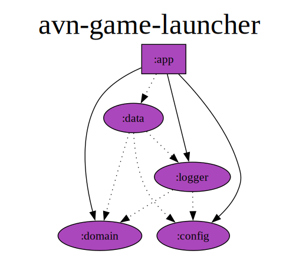

# AVN Game Launcher
#### Adult Visual Novel Game Launcher for F95zone.to

[](https://github.com/p0058781/AVNGameLauncher/actions/workflows/pr.yaml) [](https://github.com/p0058781/AVNGameLauncher/actions/workflows/release.yaml)

### Features
- Start game directly from AVN Game Launcher (obviously, it's in the name)
- Automatically check for new versions of all your games
- Fast update checks
- Automatically track play time (if game is launched from AVN Game Launcher), desktop only
- Automatically find games locally
- Searching/Filtering/Sorting
- SFW Mode. Replaces images with random image, and replaces game name with random phrase
- Game updates notifications

### FAQ
- **Will login be implemented, to import games that are only accessible if logged in?**  
No, unless f95 starts disabling public access to the majority of games
- **Which file do I download?**  
  - **avn-game-launcher-{platform}-release.zip** - these are platform native packages, you don't need external dependencies (like jre) to run it, just extract and run
  - **AVN.Game.Launcher-{platform}-x64-1.0.1.jar**  - platform specific, Java 17 needs to be installed on your system
  - **androidApp-release.apk** - Android APK
- **Which platforms are supported?**  
Desktop (Linux, Mac, Windows), Android
- **Can I import non-f95 game?**  
Not currently, but it is planed. If you really want to do it you can manually add entries to the database (sqlite)
- **Where is data stored?**
  - **Windows**: `%AppData%\avnlauncher`
  - **Linux**: `~/.config/avnlauncher`
  - **MacOS**: `~/Library/Application Support/avnlauncher`
- **Automatically finding games is not working**  
You need to set you games dir in setting first. All your games need to be in the same dir
- **I set games dir in settings, but it still won't find games**
Games inside "games dir" have to be named exactly like game in the app
- **Still not finding games!!!!!!!**  
Sorry, this feature is pretty basic, you can select game executable manually in "Edit Game" screen
- **Where is the rest of the game details (description, tags, changelog, etc)**  
Click on the link in the bottom right corner of each game
- **Can periodic update check be adjusted (currently 1h)?**    
Not right now. You can check for updates manually
- **How is average play time calculated?**  
App tracks only total play time for each game, play sessions are not tracked.
Average play time is calculated from total play time of all games, and total time since first game was played
- **Why does tracking play time not work on android?**  
Android limitation
- **Which Java version is required**  
If you use platform native package, then no java is required, minimal JRE is bundled
If you want to use jar file, then minimum Java 17 is required

### Known Bugs
- Scaling issues on large dpi screens on desktop
- Platforms other than Linux aren't tested often, especially Android.

### Known Limitations
- Games that are not publicly available (without login) can't be imported. Not sure why f95 requires login for certain games
- Android can't track play time (android limitation)
- Periodic update check works only when app is open
- Due to f95 limitations, not all game details can be downloaded without login

### Planed Features
- Manually add non-f95 game
- Custom Filter/Sort options
- Browser plugin to auto import game from f95 website  
- 
Check development progress in the Github Project
  https://github.com/users/p0058781/projects/1

### Not Planed Features
- F95 login
- Display games as list or grid (currently grid only)
- View all game details directly in the app

## How to use
1. Copy game f95 thread url or game id form the url, and paste it into the first field in the import popup.
2. Click edit game to add path to executable of the game.
3. When new version is detected update icon will appear on that game (bottom right corner).  
Available version will be shown in brackets next to the current version.  
Clicking on that icon will set available version as current version
4. You can click anywhere on the game to launch it. Top bar will have message "Playing {game name}"  
There are 3 available statuses for games, you can use them however you like, I use them like this:
   - **Playing** - games that i am actively playing
   - **Waiting for Update** - games for which i completed available content, but game is not completed yet
   - **Completed** - games that are completed (by dev) and I completed playing it
5. In Edit Game popup games can be archived. Archived games don't appear with any other filter except "Archived Games"
6. In sort dropdown, clicking selected option again will invert sort direction (ascending, descending), indicated by the arrow
7. Rating stars are personal rating. Rating in brackets is F95 rating
8. Search will be performed on title and tags. Matched title will be highlighted green, matched tags will be shown on each game. Tags dont show up otherwise
9. Click anywhere on the game card to launch the game

## How to build
1. You will need JDK 17 and Android SDK
2. Execute `./gradlew run` to run desktop app for you system, or run `./gradlew packageReleaseUberJarForCurrentOS` 
to build Jar file or `./gradlew createDistributable` to create distributable with embedded jre
3. Execute `./gradlew installDebug` or `./gradlew installRelease` to install to connected device.
Or run `./gradlew assembleDebug` or `./gradlew assembleRelease` to build apk  


> [!WARNING]  
> Everything below is under construction

## Modules


### desktopApp
### androidApp
### sharedApp
### data
### logger
### config
### domain

```
Copyright (C) 2024  p0058781
This program is free software: you can redistribute it and/or modify
it under the terms of the GNU General Public License as published by
the Free Software Foundation, either version 3 of the License, or
(at your option) any later version.

This program is distributed in the hope that it will be useful,
but WITHOUT ANY WARRANTY; without even the implied warranty of
MERCHANTABILITY or FITNESS FOR A PARTICULAR PURPOSE.  See the
GNU General Public License for more details.

You should have received a copy of the GNU General Public License
along with this program.  If not, see <https://www.gnu.org/licenses/>.
```